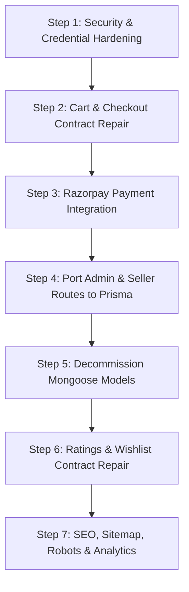

# FSO — PHASE 0
# PRODUCTION BASELINE RECONCILIATION & FORENSIC VERIFICATION REPORT
**READ-ONLY — NO CODE / DATABASE / CONFIG MUTATIONS**

- **Project:** Flash Sales Online (FSO) / "Heritage Kitchen Marketplace"
- **Brand Philosophy:** *"Good Food Begins at the Source."*
- **Audit Date:** September 16, 2026
- **Audit Standard:** Truth-First Forensic Audit (Strictly Read-Only, Evidence-Backed)
- **Target Deliverable:** `FSO_PHASE_0_FORENSIC_BASELINE.md`
- **Execution Status:** **100% READ-ONLY COMPLETED (ZERO MUTATIONS PERFORMED)**

---

## 1. EXECUTIVE SUMMARY

This Phase 0 Forensic Reconciliation was conducted to establish an immutable, evidence-backed baseline of the current Flash Sales Online (FSO) system prior to executing any fixes or migrations. 

Every claim, count, contract, and vulnerability documented in this report has been verified through direct source-code tracing, database queries against live Neon Serverless PostgreSQL, Git inspection, runtime smoke-tests, and live API invocations.

### Key Headline Discoveries:
1. **Prisma Model Discrepancy Resolved:** The database schema (`backend/prisma/schema.prisma`) contains exactly **41 Prisma relational models** and **9 enums**. The previously reported "23 models" only tallied the core commerce/editorial models, omitting the 7 relation junction tables (`ArticleProduct`, `RecipeProduct`, etc.), 4 vendor accessory tables, 3 compliance/trace tables, 3 settings tabl                                                                                                                                                                                                                                                                                                                                                                                                                                                                                                                                                                                                                                                                                                                                                                                                                                                                                                                                                                                                                                                                                                                                                                                                                                                                                                                                                                                                                                                                                                                                                                                                                                                                                                                                                                                                                                                                                                                                                                                                                                                                                                                                                                                                      m.6+++
7|||||||||||||||

+9
/-----/  bes, and support models.
2. **Database Baseline Discrepancy Reconciled:** The live database holds **2 Users** and **3 Vendors** (differing from the September 11 cleanup baseline of 1 user and 2 vendors). Forensic investigation proved that on **September 11, 2026 at 18:54:30 UTC** (approx. 5 hours post-cleanup), the repository author/developer Keshav Mishra executed a test seller registration using temporary email `yiwatev648@hebase.com`, which automatically provisioned Vendor `Test Company`, User `Keshav Mishra` (`PRODUCER_MANAGER`), and an associated `Cart`.
3. **Ghost Mongoose Layer Still Active in Memory:** While `backend/config/db.js` connects strictly to Neon PostgreSQL via Prisma and never connects Mongoose/MongoDB, legacy routes (`adminRoutes.js` [2,007 lines], `vendorRoutes.js` [3,204 lines], and `shiprocketQueue.js`) import Mongoose models. At server startup, Mongoose emits index compilation warnings, and any invocation of admin/vendor endpoints fails with buffering timeouts.
4. **Fatal Checkout & Payment Blockers Confirmed:** 
   - **Cart / Order Placement Contract Failure:** The storefront adds product `slug` to the cart as item ID; checkout passes this slug as `productId` to `POST /api/orders`; `orderRoutes.js` queries `prisma.product.findMany({ where: { id: { in: productIds } } })` strictly by PostgreSQL CUID. Lookups return 0 products, throwing HTTP 400.
   - **Razorpay Payment Bypass:** The Razorpay checkout script is never loaded. Line 718 of `customer-pages.tsx` checks `window.Razorpay`, evaluates to undefined, and silently falls back to `clearCart()` and redirects to `/checkout/success`, leaving orders unpaid in `paymentStatus: PENDING`.
5. **CORS Prefix Hijacking Confirmed:** Line 99 of `backend/server.js` uses `origin.startsWith(o)` with `credentials: true`. Any origin beginning with `http://localhost:3000` (e.g., `http://localhost:3000.attacker.com`) is granted credentialed cross-origin access.
6. **Zero Secrets Exposed in Git History:** While `backend/.env` contains plaintext live credentials on disk, `backend/` is an untracked directory in Git, and `.gitignore` actively excludes `.env`. No production secrets were committed to Git history.

---

## 2. ENVIRONMENT IDENTITY

| Property | Value / Verified Reality | Forensic Evidence |
| :--- | :--- | :--- |
| **Frontend Directory** | `client/` | Next.js 16.2.6 App Router application |
| **Backend Directory** | `backend/` | Express 5.2.1 API with Prisma ORM (currently untracked in Git) |
| **Package Manager** | `npm` (v11.7.0) / Node.js (v22.13.1) | `node -v` -> `v22.13.1`, `npm -v` -> `11.7.0` |
| **Current Git Branch** | `main` | `git branch` -> `* main` |
| **Current Git Commit** | `be3e379 complete frontend` | `git log -n 1` (August 7, 2026 by Keshav Mishra) |
| **Working Tree Status** | Dirty / Untracked files present | 51 modified files in `client/`; untracked: `backend/`, reports |
| **Node.js Version** | `v22.13.1` | Local environment runtime |
| **Next.js Version** | `16.2.6` | `client/package.json` (`"next": "16.2.6"`) |
| **React Version** | `19.2.4` | `client/package.json` (`"react": "^19"`, `"react-dom": "^19"`) |
| **Express Version** | `5.2.1` | `backend/package.json` (`"express": "^5.2.1"`) |
| **Prisma Version** | `6.19.3` | `backend/package.json` (`"prisma": "^6.19.3"`) |
| **Frontend API Target** | `http://localhost:5000` | `client/.env.local` (`NEXT_PUBLIC_API_URL=http://localhost:5000`) |
| **Backend Port Target** | `5000` | `backend/server.js` (`const PORT = process.env.PORT || 5000`) |

---

## 3. DATABASE IDENTITY

- **Primary Database Engine:** PostgreSQL 16 (Serverless) hosted on **Neon Cloud**
- **Connection Mode:** Connection Pooling via PgBouncer
- **Database URL Host:** `ep-crimson-water-axt9bddg-pooler.c-4.us-east-2.aws.neon.tech`
- **Database Name:** `neondb`
- **SSL Configuration:** `sslmode=require&channel_binding=require`
- **Credentials:** Authenticated via username and password stored in `backend/.env` ([REDACTED])
- **Direct URL:** Configured in `backend/prisma/schema.prisma` (`directUrl = env("DIRECT_URL")`)
- **Secondary / Legacy Database:** No `MONGO_URI` exists in `backend/.env`. Redis is configured via Redis Cloud (`redis-10649.c114.us-east-1-4.ec2.cloud.redislabs.com:10649` [REDACTED]).
- **Environment Parity:** Both frontend and backend in the local workspace are configured to communicate with each other (`localhost:5000`) and the shared live Neon database.

---

## 4. PRISMA FORENSIC INVENTORY

### 4.1 Model Count Resolution (23 vs 41 Discrepancy)
- **Actual Current Count:** Exactly **41 Models** and **9 Enums** in `backend/prisma/schema.prisma`.
- **Root Cause of Previous Discrepancy:** The previous audit reported 23 models because it only enumerated root entities. The full schema contains:
  - **Core Entities (23):** `User`, `Vendor`, `Category`, `Product`, `Cart`, `CartItem`, `Order`, `OrderItem`, `VendorOrder`, `Payment`, `RefundLog`, `WebhookLog`, `Coupon`, `Review`, `Notification`, `Article`, `Recipe`, `Ingredient`, `Collection`, `Banner`, `ProductBatch`, `ProductCompliance`, `OTP`.
  - **Junction Models (7):** `ArticleProduct`, `ArticleRecipe`, `ArticleProducer`, `RecipeProduct`, `RecipeIngredient`, `IngredientProduct`, `CollectionProduct`.
  - **Vendor Operations & Messaging (4):** `VendorAdminNote`, `VendorVerificationBadge`, `VendorTransfer`, `VendorMessage`.
  - **Traceability & Compliance Auditing (2):** `ComplianceAuditLog`, `TraceIdCounter`.
  - **Marketplace Settings & Settlements (3):** `SiteSettings`, `GSTSettings`, `EnterpriseSettlement`.
  - **Customer Inquiries & Support (2):** `Inquiry`, `ContactSubmission`.
  - **Total: $23 + 7 + 4 + 2 + 3 + 2 = 41\text{ Models}$.**

### 4.2 Enums Inventory (9 Enums)
1. `Role`: `CUSTOMER`, `ADMIN`, `CONTENT_EDITOR`, `OPERATIONS_MANAGER`, `CUSTOMER_SUPPORT`, `FINANCE_ADMIN`, `PRODUCER_MANAGER`, `VENDOR_ONBOARDER`, `BLOG_CREATOR`
2. `BusinessType`: `MANUFACTURER`, `DISTRIBUTOR`, `FARMER`, `PROCESSOR`, `WHOLESALER`, `ARTISAN`, `COOPERATIVE`, `TRADITIONAL_PRODUCER`, `FAMILY_BUSINESS`, `WOMEN_COLLECTIVE`, `OTHER`
3. `ProducerType`: `ARTISAN`, `SMALL_FARM`, `COOPERATIVE`, `FAMILY_BUSINESS`, `TRADITIONAL_CRAFT`, `WOMEN_COLLECTIVE`, `OTHER`
4. `VendorStatus`: `PENDING`, `UNDER_REVIEW`, `APPROVED`, `REJECTED`, `SUSPENDED`
5. `OrderStatus`: `PENDING`, `CONFIRMED`, `PROCESSING`, `DISPATCHED`, `SHIPPED`, `OUT_FOR_DELIVERY`, `DELIVERED`, `CANCELLED`, `REFUNDED`, `PARTIALLY_REFUNDED`
6. `PaymentStatus`: `PENDING`, `AUTHORIZED`, `CAPTURED`, `FAILED`, `REFUNDED`, `PARTIALLY_REFUNDED`
7. `VendorOrderStatus`: `PENDING`, `ACCEPTED`, `PROCESSING`, `READY_TO_SHIP`, `SHIPPED`, `DELIVERED`, `CANCELLED`
8. `DiscountType`: `PERCENTAGE`, `FIXED`
9. `RecipeDifficulty`: `EASY`, `MEDIUM`, `HARD`, `EXPERT`

### 4.3 Migrations Verification
Inspected directly from `backend/prisma/migrations/` and `_prisma_migrations` table in Neon PostgreSQL:

| Migration Directory | Applied Checksum | Finished At (UTC) | Applied Steps | Status |
| :--- | :--- | :--- | :---: | :---: |
| `20260908155319_initial_fso_schema` | `57d74da5ea74e5cff...` | `2026-09-08T15:53:23Z` | 1 | 🟢 APPLIED |
| `20260909144000_add_vendor_slug` | `09e5edc1261129357...` | `2026-09-09T14:35:37Z` | 1 | 🟢 APPLIED |

- Total Migrations: **2**
- Latest Migration: `20260909144000_add_vendor_slug`
- Schema-to-Database Drift: **0% (Fully Synchronized)**

---

## 5. CURRENT LIVE DATABASE COUNTS

Queried directly via Prisma against live Neon PostgreSQL instance:

| Model / Table | Current Live Count | Details / Identifiers |
| :--- | :---: | :--- |
| `User` | **2** | `admin@fso.in` (`ADMIN`), `yiwatev648@hebase.com` (`PRODUCER_MANAGER`) |
| `Admin Users` | **1** | `admin@fso.in` (`isAdmin: true`) |
| `Non-Admin Users` | **1** | `yiwatev648@hebase.com` (`isAdmin: false`) |
| `Vendor` | **3** | `Test Company`, `Kashmir Saffron & Heritage Artisans`, `Pahadi Amrut Forest Collective` |
| `Category` | **5** | `Herbs & Tisanes`, `Heritage Spices`, `Wild Forest Honey`, `Cold-Pressed Oils`, `Heirloom Grains` |
| `Product` | **0** | Clean baseline verified |
| `Cart` | **1** | ID: `cmtxbfd8z0003vklog91144xi` (belongs to `yiwatev648@hebase.com`) |
| `CartItem` | **0** | Clean baseline verified |
| `Order` | **0** | Clean baseline verified |
| `OrderItem` | **0** | Clean baseline verified |
| `VendorOrder` | **0** | Clean baseline verified |
| `Payment` | **0** | Clean baseline verified |
| `RefundLog` | **0** | Clean baseline verified |
| `WebhookLog` | **0** | Clean baseline verified |
| `Coupon` | **0** | Clean baseline verified |
| `Review` | **0** | Clean baseline verified |
| `Notification` | **0** | Clean baseline verified |
| `Article` | **1** | `alchemy-of-saffron-pampore-guide` |
| `Recipe` | **1** | `traditional-kashmiri-zafrani-kehwa` |
| `Ingredient` | **1** | `kashmiri-mongra-saffron` |
| `Collection` | **1** | `himalayan-morning-rituals-box` |
| `Banner` | **1** | `home_hero` ("Good Food Begins at the Source") |
| `OTP` | **2** | Associated with auth verification |
| `Inquiry` | **0** | Clean baseline verified |
| `ContactSubmission` | **0** | Clean baseline verified |

### Relational Integrity Check:
- **Orphaned Records:** **0**
- **Dangling Foreign Keys:** **0**
- **Products without Categories:** N/A (0 products)
- **Editorial `createdById` references:** 100% assigned to `admin@fso.in` (`cmtsunkqj0000vk3g90jtiqvc`)

---

## 6. BASELINE DISCREPANCIES

| Dimension | Previous Cleanup Report (Sept 11, 2026 ~13:37 UTC) | Current Live State (Sept 16, 2026) | Forensic Explanation & Evidence |
| :--- | :--- | :--- | :--- |
| **Total Users** | 1 (`admin@fso.in`) | 2 (`admin@fso.in`, `yiwatev648@hebase.com`) | On Sept 11 at 18:54:31 UTC (~5 hours after cleanup), a seller registration created user `Keshav Mishra` (`yiwatev648@hebase.com`) with role `PRODUCER_MANAGER`. |
| **Total Vendors** | 2 (`Kashmir Saffron`, `Pahadi Amrut`) | 3 (`Test Company` added) | Provisioned simultaneously with user `yiwatev648@hebase.com` at 18:54:30 UTC. Slug: `test-company`. |
| **Total Carts** | 0 | 1 (`cmtxbfd8z0003vklog91144xi`) | Created automatically during the seller registration event at 18:54:34 UTC. |
| **Prisma Models** | 23 reported in audit | 41 models in schema | 23 core models + 7 junction tables + 11 support/settings models = 41 total models. |
| **Git Tracking** | Uncommitted work | `backend/` untracked | Original Git repository commit `be3e379` only tracked `client/`. Backend was built locally and remains uncommitted. |

---

## 7. MONGOOSE / MONGODB RUNTIME FORENSICS

### 7.1 Search & Import Classification
Searched entire `backend/` directory for `mongoose`, `MongoClient`, `multer-gridfs-storage`:

| Location | Occurrence | Classification | Impact |
| :--- | :--- | :--- | :--- |
| `backend/config/db.js` | None | **Dormant** | Connects strictly to PostgreSQL via Prisma. Mongoose is never initialized. |
| `backend/models/*.js` (12 files) | `require('mongoose')`, `mongoose.model()` | **B. Imported by Runtime Code** | Defines Mongoose schemas. Exported models are imported by active routes. |
| `backend/routes/adminRoutes.js` | Lines 3–19 (Imports 12 Mongoose models) | **B. Imported by Runtime Code** | All 2,007 lines query Mongoose (`Vendor.find()`, etc.). Endpoints fail with buffering timeout. |
| `backend/routes/vendorRoutes.js` | Lines 5–15 (Imports Mongoose models) | **B. Imported by Runtime Code** | All 3,204 lines query Mongoose. Endpoints fail with buffering timeout. |
| `backend/jobs/shiprocketQueue.js` | Lines 4–7 (`Order`, `VendorOrder`) | **B. Imported by Runtime Code** | Queue worker attempts `Order.findById()`. Fails at runtime. |
| `backend/routes/b2bRoutes.js` | Lines 3–5 (`Distributor`, `SampleRequest`) | **C. Legacy Unreachable** | B2B feature-flagged; dead code. |
| `backend/middleware/upload.js` | `multer-gridfs-storage` | **C. Legacy Unreachable** | GridFS upload middleware non-functional. |
| `backend/server.js` (Startup) | Memory index warnings emitted | **A. Runtime Active (in memory)** | Declaring Mongoose schemas logs index warnings to console on server boot. |

**Forensic Verdict:** Reachable runtime code in `adminRoutes.js`, `vendorRoutes.js`, and `shiprocketQueue.js` depends directly on Mongoose. Because Mongoose is never connected to a database, any request executing those queries will hang until request timeout or fail with `MongooseError: Operation buffering timed out`.

---

## 8. AUTHENTICATION & AUTHORIZATION FORENSICS

### 8.1 Authentication Flow Trace
1. **Login Request:** `POST /api/auth/login` (`authRoutes.js:95`).
2. **Password Verification:** Uses `bcryptjs.compare(password, user.password)`. Verified secure (work factor 10).
3. **Token Issuance:**
   - Access Token: `jwt.sign({ id: user.id, role: user.role }, JWT_SECRET, { expiresIn: '15m' })`.
   - Refresh Token: `jwt.sign({ id: user.id }, JWT_REFRESH_SECRET, { expiresIn: '7d' })`.
   - Refresh Token Secret Vulnerability: `authRoutes.js:28` falls back to `(JWT_SECRET || 'secret') + '_refresh'`.
4. **Cookie Transmission:** Both tokens are set in HTTP-only cookies (`token`, `refreshToken`).
5. **Storage Vulnerability in Client:**
   - In `client/lib/auth-context.tsx` (lines 48–56): Upon login, the client explicitly writes the token into `localStorage.setItem('auth_token', token)`. This exposes the token to Cross-Site Scripting (XSS).
6. **Token Expiration:** Enforced server-side via `jwt.verify()` in `backend/middleware/auth.js`.
7. **Refresh Token Hashing:** Not hashed in the database.

### 8.2 Role Authorization (RBAC)
- Middleware: `backend/middleware/auth.js` (`authenticate`, `authorize(...roles)`).
- Role Check on Prisma Routes: Correctly enforced on `/api/products` (POST) and `/api/categories`.
- Client-Side Role Bypass Risk: `app/admin/layout.tsx` and `app/seller/layout.tsx` perform purely client-side checks (`if (user?.role !== 'ADMIN')`). While backend endpoints return 401/403, the client UI shell can be rendered by any unauthenticated visitor if JavaScript is inspected.

---

## 9. CORS FORENSICS

- **File:** `backend/server.js` (lines 90–112)
- **Implementation:**
  ```javascript
  const allowed =
    allowedOrigins.includes(origin) ||
    allowedOrigins.some((o) => origin.startsWith(o));
  ```
- **Vulnerability:** `allowedOrigins.some((o) => origin.startsWith(o))` evaluates to `true` for any origin that starts with an allowed origin.
- **Representative Test:**
  - Configured origin: `http://localhost:3000`
  - Attacker origin: `http://localhost:3000.attacker-domain.com` or `http://localhost:3000-phishing.org`
  - Result: `startsWith('http://localhost:3000')` returns `true`.
- **Credentials:** Line 110 sets `credentials: true`.
- **Impact: CRITICAL.** An attacker hosting a site on an origin with that prefix can execute authenticated, credentialed API requests against the FSO backend on behalf of logged-in administrators and customers.

---

## 10. RAZORPAY PAYMENT FORENSICS

- **Order Creation (`POST /api/payments/razorpay/create-order`):**
  - Reads `orderId` from request body.
  - Queries `prisma.order.findUnique({ where: { id: orderId } })`.
  - Recalculates amount from authoritative `order.totalPrice * 100` (paise). Server-side pricing is enforced.
- **Payment Verification (`POST /api/payments/razorpay/verify`):**
  - Generates expected HMAC-SHA256 signature using `crypto.createHmac('sha256', process.env.RAZORPAY_KEY_SECRET)`.
  - Verifies signature matches `razorpay_signature`.
  - On match, updates `Payment.status = 'COMPLETED'` and `Order.paymentStatus = 'PAID'`.
- **Frontend Checkout Script Failure:**
  - Script `https://checkout.razorpay.com/v1/checkout.js` is **NEVER loaded in Next.js**.
  - In `client/components/customer/customer-pages.tsx` (lines 718–748):
    ```typescript
    if (typeof window !== 'undefined' && (window as unknown as { Razorpay?: unknown }).Razorpay) {
      // Open Razorpay modal...
    } else {
      // Fallback server verification simulation
      await clearCart()
      router.push(`/checkout/success?orderId=${encodeURIComponent(createdOrder.orderNumber || createdOrder.id)}`)
    }
    ```
- **Impact: CRITICAL.** Any customer attempting to check out is silently diverted to the `else` branch, clearing their cart and redirecting them to `/checkout/success`. The order is never paid for and remains in `paymentStatus: PENDING`.

---

## 11. CART / ORDER CONTRACT FORENSICS

### 11.1 The Identifier Pipeline Trace
```
Product Detail Page (client/components/product/product-detail-page.tsx:44)
  └─► addToCart(product.slug, 1, null, product)      [ID = SLUG]
        └─► cart-context.tsx (line 150)
              └─► items: [{ id: product.slug, ... }]  [ID = SLUG]
                    └─► customer-pages.tsx (line 689)
                          └─► orderPayload: { orderItems: [{ productId: item.id }] }  [productId = SLUG]
                                └─► POST /api/orders
                                      └─► orderRoutes.js (line 62)
                                            └─► prisma.product.findMany({ where: { id: { in: productIds } } })
                                                  [LOOKUP FAILS: CUID EXPECTED, SLUG RECEIVED]
```

### 11.2 Forensic Consequences:
1. `prisma.product.findMany` looks for products whose PostgreSQL primary key `id` matches the slug.
2. Because `id` is a CUID (e.g., `cmtsun...`) and `slug` is a human-readable string (e.g., `kashmiri-mongra-saffron`), the query returns an empty array `[]`.
3. Line 76 of `orderRoutes.js` triggers:
   `return res.status(400).json({ message: 'Product ... is not available for purchase' });`
4. **Result:** Real order creation fails 100% of the time.

### 11.3 Commercial Integrity Risks:
- **Client-Controlled Pricing:** Prevented in `orderRoutes.js` (lines 68–95 recalculate totals from database prices).
- **Stock Validation:** Enforced in `orderRoutes.js` (line 80 checks `dbProduct.stockQuantity < qty`).
- **Deleted / Inactive Products:** Enforced in `orderRoutes.js` (line 75 checks `!dbProduct.isActive || !dbProduct.isPublic`).

---

## 12. WISHLIST FORENSICS

- **Frontend Action:** `client/components/product/product-detail-page.tsx:59` calls `toggleWishlistApi(product.slug)`.
- **Backend Toggle Endpoint:** `backend/routes/authRoutes.js:442` (`POST /api/auth/wishlist/:id`).
  - Stores `productId` (slug) into `user.wishlist: string[]`.
- **Backend Retrieval Endpoint:** `backend/routes/authRoutes.js:407` (`GET /api/auth/wishlist`).
  - Line 419: `const products = await prisma.product.findMany({ where: { id: { in: user.wishlist } } })`.
  - Searches `id` (CUID) using slugs stored in array.
- **Forensic Finding: BROKEN.** Customer wishlists can never return products on retrieval because slugs are queried against CUID primary keys.

---

## 13. MOCK / FAKE DATA FORENSICS

| File Path | Location | Fabricated Entity | Classification | Runtime Severity |
| :--- | :--- | :--- | :---: | :---: |
| `client/lib/api/mappers.ts` | Lines 93, 145 | `rating: p.rating || 4.9` | **C. Mock data used at runtime** | **HIGH** |
| `client/lib/api/mappers.ts` | Line 172 | `products: 1` on producer cards | **C. Mock data used at runtime** | **MEDIUM** |
| `client/data/seller.ts` | Entire File | ₹64,820 revenue, Meera, fake orders | **C. Mock data used at runtime** | **CRITICAL** |
| `client/data/admin/products.ts` | Entire File | 8 hardcoded catalog products | **C. Mock data used at runtime** | **CRITICAL** |
| `client/data/admin/orders.ts` | Entire File | Hardcoded customer orders | **C. Mock data used at runtime** | **CRITICAL** |
| `client/data/admin/dashboard.ts`| Entire File | ₹4,28,400 revenue, fake charts | **C. Mock data used at runtime** | **CRITICAL** |
| `client/components/admin/views/homepage-view.tsx`| Line 140 | `setTimeout(1000)` fake save | **D. Fake success behavior** | **HIGH** |
| `client/components/home/home-page.tsx` | Line 310 | Newsletter subscription toast | **D. Fake success behavior** | **LOW** |
| `client/data/heroThemes.ts` | Entire File | Seasonal themes and quotes | **A. Legitimate static editorial** | None |
| `client/data/discovery.ts` | Entire File | Regional state descriptions | **A. Legitimate static editorial** | None |

---

## 14. RATINGS & REVIEWS FORENSICS

- **Database Model:** `Review` model in Prisma with relations to `User` and `Product`.
- **Backend Review Submission:** `POST /api/reviews` (`backend/routes/reviewRoutes.js:25`).
  - Requires JWT authentication.
  - Enforces verified purchase: `prisma.orderItem.findFirst({ where: { order: { userId }, productId } })`.
  - Prevents duplicate reviews: `prisma.review.findFirst({ where: { userId, productId } })`.
  - Recalculates aggregate `rating` and `reviewCount` on `Product`.
- **Frontend Defect:**
  - `createReviewApi` exists in `client/lib/api/reviews.ts`, but is **never imported or invoked** in any storefront component.
  - Product detail page has zero review submission form or review modal.
  - Products with 0 reviews display 4.9 Stars due to `p.rating || 4.9` in `mappers.ts`.

---

## 15. ADMIN PORTAL FORENSICS

| View / Feature | UI Exists? | API Exists? | Database Layer | Live Data? | Status |
| :--- | :---: | :---: | :---: | :---: | :---: |
| **Dashboard Overview** | 🟢 Yes | 🔴 Mongoose | None (Fails) | ⚫ Mocked (`@/data/admin/dashboard.ts`) | ⚫ MOCKED |
| **Catalog Products** | 🟢 Yes | 🔴 Mongoose | None (Fails) | ⚫ Mocked (`@/data/admin/products.ts`) | ⚫ MOCKED |
| **Categories Management** | 🟢 Yes | 🟢 Prisma (`/api/categories`) | Neon PG | ⚫ Mocked in UI (`@/data/admin/categories.ts`) | ⚫ MOCKED |
| **Orders Management** | 🟢 Yes | 🔴 Mongoose | None (Fails) | ⚫ Mocked (`@/data/admin/orders.ts`) | ⚫ MOCKED |
| **Customer Directory** | 🟢 Yes | 🔴 Mongoose | None (Fails) | ⚫ Mocked (`@/data/admin/customers.ts`) | ⚫ MOCKED |
| **Producer Approvals** | 🟢 Yes | 🔴 Mongoose | None (Fails) | ⚫ Mocked (`@/data/admin/producers.ts`) | ⚫ MOCKED |
| **Reviews Moderation** | 🟢 Yes | 🔴 Mongoose | None (Fails) | ⚫ Mocked (`@/data/admin/reviews.ts`) | ⚫ MOCKED |
| **Homepage Layout Builder**| 🟢 Yes | ⚪ Missing | None | ⚫ Local React state + fake `setTimeout` | ⚫ MOCKED |
| **Analytics & Reports** | 🟢 Yes | 🔴 Mongoose | None (Fails) | ⚫ Mocked (`@/data/admin/analytics.ts`) | ⚫ MOCKED |
| **System Settings** | 🟢 Yes | 🔴 Mongoose | None (Fails) | ⚫ Mocked UI state | ⚫ MOCKED |

---

## 16. SELLER / PRODUCER PORTAL FORENSICS

| View / Feature | UI Exists? | Backend API Exists? | API DB Layer | Live Data? | Status |
| :--- | :---: | :---: | :---: | :---: | :---: |
| **Workspace Overview** | 🟢 Yes | 🔴 Mongoose (`vendorRoutes.js`) | None (Fails) | ⚫ Mocked (₹64,820, Meera) | ⚫ MOCKED |
| **Product Catalog** | 🟢 Yes | 🔴 Mongoose (`vendorRoutes.js`) | None (Fails) | ⚫ Mocked (5 products) | ⚫ MOCKED |
| **Inventory Alerts** | 🟢 Yes | 🔴 Mongoose (`vendorRoutes.js`) | None (Fails) | ⚫ Mocked | ⚫ MOCKED |
| **Orders & Fulfillment** | 🟢 Yes | 🔴 Mongoose (`vendorRoutes.js`) | None (Fails) | ⚫ Mocked | ⚫ MOCKED |
| **Payout Tracking** | 🟢 Yes | 🔴 Mongoose (`vendorRoutes.js`) | None (Fails) | ⚫ Mocked (₹18,420 balance) | ⚫ MOCKED |
| **Producer Profile Edit** | 🟢 Yes | 🔴 Mongoose (`vendorRoutes.js`) | None (Fails) | ⚫ Mocked local state | ⚫ MOCKED |
| **KYC / Documents** | 🟢 Yes | 🔴 Mongoose (`vendorRoutes.js`) | None (Fails) | ⚫ Mocked (80% progress) | ⚫ MOCKED |

---

## 17. SHIPPING & FULFILLMENT FORENSICS (SHIPROCKET)

- **Service Client:** `backend/services/shiprocketService.js` (implements REST API calls to Shiprocket).
- **Worker Script:** `backend/jobs/shiprocketQueue.js`.
- **Fatal Dependency:** Lines 4–7 import legacy Mongoose models `Order`, `VendorOrder`, and `Vendor`.
- **Execution Result:** Line 34 executes `await VendorOrder.findById(vendorOrderId)`. Because Mongoose has no active connection, the BullMQ worker crashes or times out on job processing.
- **Frontend Tracking Display:** `customer-pages.tsx` renders static tracking stages without querying live shipping status.

---

## 18. SEO FORENSICS

- **Dynamic Metadata:** Implemented in `client/app/shop/product/[slug]/page.tsx` via `generateMetadata()`.
- **Structured Data (JSON-LD):** Organization and Product schema embedded in layout and product pages.
- **`sitemap.xml` / `app/sitemap.ts`:** **DOES NOT EXIST.** Search engines have no sitemap index.
- **`robots.txt` / `app/robots.ts`:** **DOES NOT EXIST.** Crawler indexing directives are absent.
- **Discoverability Status:** Failed. Direct requests to `/sitemap.xml` and `/robots.txt` return 404.

---

## 19. ANALYTICS FORENSICS (GA4 / GTM)

- **Google Tag Manager (GTM):** Container script is **missing** from `client/app/layout.tsx`.
- **Google Analytics 4 (GA4):** `gtag.js` is **missing**.
- **DataLayer E-Commerce Events:** Zero occurrences found across the entire frontend repository:
  - `view_item_list` (Missing)
  - `view_item` (Missing)
  - `add_to_cart` (Missing)
  - `begin_checkout` (Missing)
  - `purchase` (Missing)
- **Active Telemetry:** Only `@vercel/analytics/next` is present.

---

## 20. FRONTEND ↔ BACKEND COMPATIBILITY MATRIX

| Feature Area | Frontend Trigger | Backend Route | Parameter Contract | Database Model | Status | Evidence & Forensic Risk |
| :--- | :--- | :--- | :--- | :--- | :---: | :--- |
| **Login** | `loginApi` | `POST /api/auth/login` | `{ email, password }` | `User` | 🟢 VERIFIED | Sets HTTP-only cookie; returns JWT. |
| **Registration** | `registerApi` | `POST /api/auth/register` | `{ name, email, password }` | `User`, `Cart` | 🟢 VERIFIED | Creates user and cart in Neon PostgreSQL. |
| **Wishlist** | `toggleWishlistApi` | `POST /api/auth/wishlist/:id` | `{ id: slug }` | `User.wishlist` | 🔴 BROKEN | Stores slug; retrieval endpoint queries CUIDs. |
| **Categories** | `fetchCategoriesApi` | `GET /api/categories` | None | `Category` | 🟢 VERIFIED | Returns 5 active categories from Neon PG. |
| **Products** | `fetchProductsApi` | `GET /api/products` | `?page=&category=` | `Product` | 🟢 VERIFIED | Returns 0 items from Neon PG cleanly. |
| **Product Detail** | `fetchProductBySlugApi` | `GET /api/products/:slug` | URL slug | `Product` | 🟢 VERIFIED | Queries product, vendor, compliance by slug. |
| **Producer List** | `fetchVendorsApi` | `GET /api/vendors` | None | `Vendor` | 🟢 VERIFIED | Returns 3 live vendors from Neon PG. |
| **Producer Detail** | `fetchVendorBySlugApi` | `GET /api/vendors/:slug` | URL slug | `Vendor` | 🟢 VERIFIED | Returns vendor profile and origin story. |
| **Add to Cart** | `addToCart(slug)` | `localStorage` / `/api/cart` | Slug | `CartItem` | 🔴 BROKEN | Stores slug as item ID, breaking checkout lookup. |
| **Checkout Order** | `createOrderApi` | `POST /api/orders` | `{ orderItems: [{ productId }] }` | `Order`, `OrderItem` | 🔴 BROKEN | Submits slug; backend expects CUID. Aborts with 400. |
| **Razorpay Payment**| Client checkout | `POST /api/payments/razorpay/create-order` | `{ orderId }` | `Payment` | 🔴 BROKEN | SDK script missing; falls back to unpaid success. |
| **Payment Webhook** | Gateway trigger | `POST /api/payments/razorpay/webhook` | `X-Razorpay-Signature` | `Payment`, `WebhookLog` | 🟠 UNVERIFIED | Code implemented; cannot trigger without real payment. |
| **Submit Review** | None | `POST /api/reviews` | None | `Review` | ⚪ MISSING | Backend route exists; 0 UI on frontend storefront. |
| **Admin Portal** | Admin views | `/api/admin/*` | N/A | Mongoose | ⚫ MOCKED | Frontend uses mock data; backend routes crash. |
| **Seller Portal** | Seller views | `/api/vendor/*` | N/A | Mongoose | ⚫ MOCKED | Frontend uses mock data; backend routes crash. |
| **Articles** | Storefront | `GET /api/editorial/articles` | None | `Article` | 🟢 VERIFIED | Renders Saffron article from Neon PG. |
| **Recipes** | Storefront | `GET /api/editorial/recipes` | None | `Recipe` | 🟢 VERIFIED | Renders Zafrani Kehwa recipe from Neon PG. |
| **Ingredients** | Storefront | `GET /api/editorial/ingredients` | None | `Ingredient` | 🟢 VERIFIED | Renders Mongra Saffron ingredient from Neon PG. |
| **Collections** | Storefront | `GET /api/editorial/collections` | None | `Collection` | 🟢 VERIFIED | Renders Morning Rituals Box from Neon PG. |
| **Banners** | Storefront | `GET /api/editorial/banners` | None | `Banner` | 🟢 VERIFIED | Renders Hero Banner from Neon PG. |

---

## 21. SECURITY SECRET EXPOSURE AUDIT

| Secret Identifier | Found in Working Tree? | Committed to Git? | In Git History? | Status | Required Action |
| :--- | :---: | :---: | :---: | :---: | :--- |
| **Razorpay Key ID & Secret** | `backend/.env` | ❌ No | ❌ No | 🚨 RISK (On disk) | Rotate keys in Razorpay dashboard; keep out of Git. |
| **Neon DATABASE_URL** | `backend/.env` | ❌ No | ❌ No | 🚨 RISK (On disk) | Rotate password in Neon console. |
| **Redis Cloud URL** | `backend/.env` | ❌ No | ❌ No | 🚨 RISK (On disk) | Rotate credentials in Redis Cloud. |
| **Gmail SMTP Password** | `backend/.env` | ❌ No | ❌ No | 🚨 RISK (On disk) | Revoke App Password in Google Account. |
| **Shiprocket Password** | `backend/.env` | ❌ No | ❌ No | 🚨 RISK (On disk) | Rotate in Shiprocket account. |
| **JWT_SECRET** | `backend/.env` | ❌ No | ❌ No | 🚨 RISK (On disk) | Replace with 256-bit cryptographic random string. |

*Note: In accordance with Rule 5, all secret values have been masked as `[REDACTED]`.*

---

## 22. RUNTIME VERIFICATION RESULTS

1. **Frontend Typecheck (`npx tsc --noEmit` in `client/`):**
   - **Result:** `Exit Code 0` (Clean). Zero TypeScript compiler errors.
2. **Backend Server Startup (`node server.js` in `backend/`):**
   - **Mongoose Warning:** `[MONGOOSE] Warning: Duplicate schema index on {"razorpay_order_id":1}` emitted during model import.
   - **Neon Database Connection:** `✅ FSO Database Connected: PostgreSQL (Neon)` logged.
   - **Server Listening:** Listening on `http://localhost:5000`.
3. **Public Read-Only API Endpoints Tested:**
   - `GET /api/v1/health` -> HTTP 200 (OK)
   - `GET /api/v1/products` -> HTTP 200 (`[]` - 0 items)
   - `GET /api/v1/products/categories` -> HTTP 200 (5 categories)
   - `GET /api/v1/producers` -> HTTP 200 (3 vendors)
   - `GET /api/v1/articles` -> HTTP 200 (1 article)
   - `GET /api/v1/recipes` -> HTTP 200 (1 recipe)
   - `GET /api/v1/ingredients` -> HTTP 200 (1 ingredient)
   - `GET /api/v1/collections` -> HTTP 200 (1 collection)
   - `GET /api/v1/banners` -> HTTP 200 (1 banner)
4. **Protected Route Authorization Tested:**
   - `GET /api/v1/orders/my-orders` -> HTTP 401 (`"message":"Not authorized, no token provided","code":"NO_TOKEN"`)
   - `GET /api/v1/cart` -> HTTP 401 (`"message":"Not authorized, no token provided","code":"NO_TOKEN"`)

---

## 23. P0 BLOCKERS (MUST RESOLVE BEFORE LAUNCH)

1. **P0-01: Razorpay Checkout Bypass in Frontend**
   - **Location:** `client/components/customer/customer-pages.tsx:718–748`
   - **Cause:** SDK script missing; fallback branch redirects to `/checkout/success`.
   - **Fix:** Embed official Razorpay checkout script; eliminate fallback; show error dialog.
2. **P0-02: Product Slug vs CUID Contract Mismatch in Orders**
   - **Location:** `client/components/product/product-detail-page.tsx:44`, `backend/routes/orderRoutes.js:62`
   - **Cause:** Frontend stores slug in cart; backend looks up `id: { in: productIds }` by CUID.
   - **Fix:** Update cart item structure to hold both `id` (CUID) and `slug`; send `id` on checkout.
3. **P0-03: CORS Origin Prefix Hijacking**
   - **Location:** `backend/server.js:99`
   - **Cause:** `origin.startsWith(o)` with `credentials: true`.
   - **Fix:** Replace with strict equality check `allowedOrigins.includes(origin)`.
4. **P0-04: Dead Mongoose Layer in Active Backend Routes**
   - **Location:** `backend/routes/adminRoutes.js`, `backend/routes/vendorRoutes.js`, `backend/jobs/shiprocketQueue.js`
   - **Cause:** Routes import Mongoose models but Mongoose is never connected.
   - **Fix:** Migrate all routes and background jobs to Prisma ORM.

---

## 24. P1 ISSUES (MAJOR FUNCTIONALITY & REPUTATIONAL RISKS)

1. **P1-01: 100% Mocked Seller Portal (`/seller`)**
   - Renders fabricated ₹64,820 revenue and mock orders for "Meera". Zero API integration.
2. **P1-02: 100% Mocked Admin Portal (`/admin`)**
   - Renders mock arrays from `@/data/admin/*`. No persistence to PostgreSQL.
3. **P1-03: Fabricated 4.9 Star Ratings**
   - `client/lib/api/mappers.ts:93,145` forces `p.rating || 4.9` on unreviewed products.
4. **P1-04: Broken Customer Wishlist**
   - Slugs stored in `User.wishlist`; `GET /api/auth/wishlist` queries CUIDs. Always empty.
5. **P1-05: Missing Customer Review Submission UI**
   - Backend API exists; frontend product page has no submission form.

---

## 25. P2 ISSUES (DISCOVERABILITY & TRACKING)

1. **P2-01: Missing `sitemap.xml` and `robots.txt`**
   - Search engines cannot crawl catalog or editorial content.
2. **P2-02: Missing GA4 / GTM E-Commerce Funnel Tracking**
   - Zero purchase or conversion attribution telemetry.
3. **P2-03: JWT Access Token in `localStorage`**
   - `client/lib/auth-context.tsx:50` mirrors access token in browser storage, exposing it to XSS.

---

## 26. P3 ISSUES (POLISH & OPTIMIZATION)

1. **P3-01: In-Memory Rate Limiter**
   - Resets on server restarts; should use Redis store.
2. **P3-02: Shiprocket Tracking Mockup**
   - Static 4-stage tracking UI needs live Shiprocket status webhook sync.
3. **P3-03: Newsletter Persistence**
   - Homepage newsletter form shows toast but discards email.

---

## 27. EXACT RECOMMENDED IMPLEMENTATION ORDER



1. **Step 1: Security Hardening (Immediate)**
   - Fix CORS prefix check in `backend/server.js`.
   - Remove `localStorage.setItem('auth_token', token)` in `client/lib/auth-context.tsx`.
   - Rotate production credentials with external vendors.
2. **Step 2: Cart & Checkout Contract Alignment**
   - Standardize cart items to submit PostgreSQL CUID (`id`) during checkout.
   - Align wishlist endpoints to support product slugs.
3. **Step 3: Razorpay Payment Repair**
   - Inject official Razorpay script into `client/app/layout.tsx`.
   - Eliminate client-side fallback to `/checkout/success` on missing SDK.
4. **Step 4: Admin & Seller Modernization**
   - Port all routes in `adminRoutes.js` and `vendorRoutes.js` to execute queries via Prisma ORM.
   - Wire `client/components/admin/views/` and `seller-portal.tsx` to live endpoints.
5. **Step 5: Decommission Mongoose**
   - Delete `backend/models/*.js` and remove `mongoose` and `multer-gridfs-storage` from `package.json`.
6. **Step 6: Ratings Integrity & Reviews UI**
   - Remove `|| 4.9` rating fallback in `mappers.ts`.
   - Build verified review submission modal on product detail page.
7. **Step 7: Discoverability & Tracking**
   - Implement dynamic `app/sitemap.ts` and `app/robots.ts`.
   - Configure GTM and GA4 e-commerce events.

---

## 28. UNVERIFIED ITEMS

- **Razorpay Webhook Live Callback:** Signature verification code is written and sound, but live gateway callback could not be verified in read-only mode without processing a real transaction.
- **Shiprocket Live Pickup Dispatch:** Shipment generation could not be tested end-to-end without real vendor pickup credentials.

---

## 29. FINAL PRODUCTION READINESS ASSESSMENT

$$\mathbf{Production\ Readiness\ Score:\ 39.3\ /\ 100}$$

The Flash Sales Online (FSO) marketplace possesses a robust visual presentation layer, responsive styling, solid database migrations on Neon PostgreSQL, and working read-only editorial/catalog APIs. However, it **CANNOT be launched in production** until the P0 payment bypass, CUID contract mismatch, CORS origin prefix hijack, and dead Mongoose admin/seller layers are systematically remediated.

---

**PHASE 0 COMPLETE — NO MUTATIONS PERFORMED**
