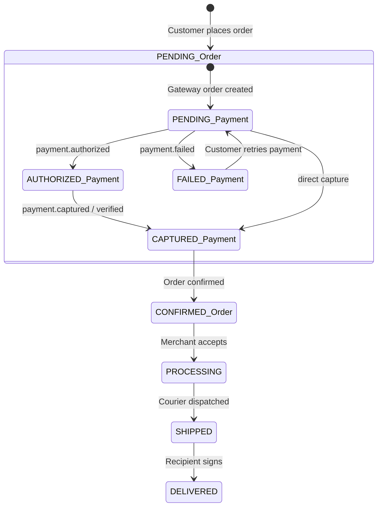

# FSO — Phase 4: Authoritative Payment State Machine Specification

**Execution Date**: September 16, 2026  
**Persistence Layer**: PostgreSQL via Prisma ORM (v6.19.3)  
**Provider**: Razorpay SDK v2.9.6  

---

## 1. Authoritative Schema Enums

### 1.1 `OrderStatus`
- `PENDING`: Initial state upon commercial contract placement.
- `CONFIRMED`: Payment authoritatively captured; commercial order approved for fulfillment.
- `PROCESSING`: Vendors assembling and packaging items.
- `DISPATCHED`: Parcels packed and awaiting courier handoff.
- `SHIPPED`: In transit with Shiprocket / 3PL provider.
- `OUT_FOR_DELIVERY`: Courier out on last-mile delivery run.
- `DELIVERED`: Successfully delivered to recipient address.
- `CANCELLED`: Contract cancelled by customer or merchant; reserved stock restored.
- `REFUNDED`: Fully refunded to original payment method.
- `PARTIALLY_REFUNDED`: Portioned financial refund processed.

### 1.2 `PaymentStatus`
- `PENDING`: Payment initialized at gateway, awaiting customer authorization/capture.
- `AUTHORIZED`: Customer approved payment, capture pending (if manual capture configured).
- `CAPTURED`: Funds authoritatively debited and captured by merchant.
- `FAILED`: Transaction rejected by issuer bank or customer cancelled at gateway.
- `REFUNDED`: Funds returned in full via provider refund API.
- `PARTIALLY_REFUNDED`: Partial credit returned to customer.

---

## 2. Razorpay Provider States & Events

| Razorpay Gateway State / Event | Meaning | FSO PaymentStatus Target | FSO OrderStatus Target |
|---|---|---|---|
| `order.created` (API call) | Gateway order initialized with authoritative paise | `PENDING` | `PENDING` |
| `payment.authorized` | Customer entered credentials and approved debit | `AUTHORIZED` | `PENDING` |
| `payment.captured` | Payment settled / auto-captured by gateway | `CAPTURED` | `CONFIRMED` |
| `order.paid` | Order fully funded at gateway | `CAPTURED` | `CONFIRMED` |
| `payment.failed` | Card expired, insufficient funds, 3DS failure | `FAILED` | `PENDING` (or `FAILED`) |
| Checkout dismissed (`modal.ondismiss`) | Customer closed payment sheet | `PENDING` | `PENDING` |
| `refund.processed` | Gateway completed financial refund | `REFUNDED` | `REFUNDED` (Phase 5) |

---

## 3. Legal State Transitions

### 3.1 Primary Forward Lifecycle
1. `(Order: PENDING, PaymentStatus: PENDING)`
2. Customer completes Razorpay Checkout.
3. Provider issues `captured` status.
4. Server asserts HMAC signature, provider order binding, amount, and currency.
5. Atomic transaction transitions to:
   `(Order: CONFIRMED, PaymentStatus: CAPTURED)`.
   Timestamp `Order.paidAt = new Date()`.

### 3.2 Authorization Staging (Two-Step Flow)
1. Customer authorizes payment (`status: "authorized"`).
2. Server validates HMAC and records:
   `(Order: PENDING, PaymentStatus: AUTHORIZED)`.
3. When `payment.captured` webhook arrives or capture API executes:
   `(Order: CONFIRMED, PaymentStatus: CAPTURED)`.

---

## 4. Illegal State Transitions (Strictly Prohibited & Protected)

| Prohibited Transition | Threat / Vulnerability | Defense Mechanism |
|---|---|---|
| `CAPTURED` $\rightarrow$ `FAILED` | Out-of-order webhook delivery or delayed payment failure callback overwriting confirmed order | Guard in `paymentController` and `razorpayWebhook`: `if (order.paymentStatus === 'CAPTURED') return;` |
| `CAPTURED` $\rightarrow$ `PENDING` | Duplicate checkout opening or stale retry reverting paid order | Rejection in `createOrder` (`400: Payment already captured`) and `verifyPayment` |
| `CONFIRMED` $\rightarrow$ `PENDING` | Customer refreshing checkout page or resubmitting form | Status check in controller rejects mutation on confirmed orders |
| `FAILED` $\rightarrow$ `CONFIRMED` (without real captured payment) | Client forging signature or claiming `success: true` | Provider status validation strictly requires `providerPayment.status === 'captured'` |
| Payment ID Rebinding | Attacker using a legitimate ₹1 payment on Order A to verify Order B (₹10,000) | `existingPayment.orderId === targetOrder.id` assertion; 409 conflict if mismatched |

---

## 5. Duplicate Webhook & Idempotency Rules

1. **Header Authority**: Webhook identity is governed by `X-Razorpay-Event-ID` / `x-razorpay-event-id`.
2. **Missing Header**: Rejection with `400 Bad Request` and zero database mutation.
3. **First Delivery**: Event recorded in `WebhookLog` with `status: 'processing'`, executed in transaction, updated to `status: 'processed'`.
4. **Subsequent Deliveries**: Checked against `WebhookLog.eventId`. If present and processed, returns `200 OK: "Event already processed"` with ZERO re-mutations, no duplicate financial records, and no duplicate notifications.

---

## 6. Payment Failure & Retry Semantics

1. **Failure Handling**:
   - If payment fails at gateway (`payment.failed`), real `pay_...` ID is persisted in `Payment` with `status: 'FAILED'` and `errorReason`.
   - The commercial `Order` is NOT deleted or corrupted; reserved inventory is preserved so the customer can retry without losing their basket.
2. **Retry Flow**:
   - Customer clicks "Retry payment" from the truthful failure UI.
   - `/api/payment/create-order` verifies that `paymentStatus !== 'CAPTURED'`.
   - Existing active Razorpay order ID is reused, or replacement is generated if stale.
   - When retry succeeds with a new `pay_...` identifier, `Payment` is upserted with `status: 'CAPTURED'`, and `Order` transitions to `CONFIRMED`.
   - Zero stock decrements occur during payment retry (inventory decrement remains at order creation from Phase 3).

---

## 7. COD Isolation Boundary

- Orders placed with `paymentMethod: 'cod'` operate entirely outside the Razorpay state machine.
- `/api/payment/create-order` explicitly rejects COD orders (`400: Order is not configured for online payment`).
- Zero Razorpay `Payment` or `WebhookLog` records are ever generated for COD orders.

---

## 8. Refund Boundary (Phase 5 Staging)

- Current `RefundLog` schema is preserved without alterations.
- `paymentService.initiateRefund` provides an audited gateway API boundary.
- Full merchant refund orchestration, partial refunds, and credit note accounting remain staged for Phase 5.
